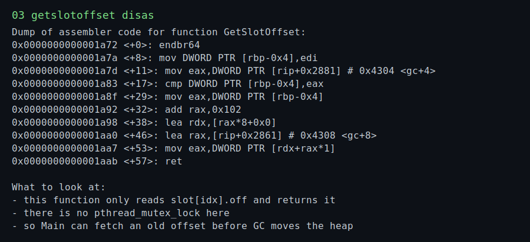
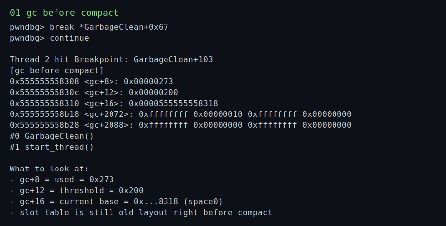
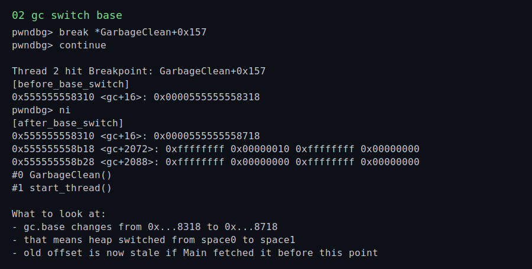
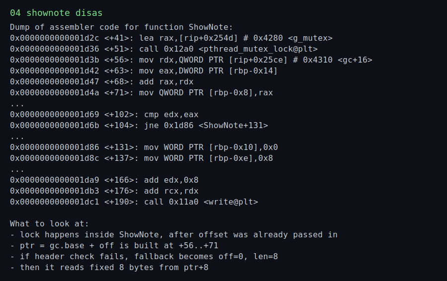

# music box 题解

## 题目信息

- 附件里有一个 `main` 和一个 `libc.so.6`
- 程序是 `64-bit`、`PIE`、`NX`、`Canary`、`Partial RELRO`
- 菜单功能很简单
  1. `Add note`
  2. `Delete note`
  3. `Edit note`
  4. `Show note`
  5. `Exit`
- 但程序还会额外启动两个后台线程
  1. `MusicBox`：不停分配、打印、释放歌词
  2. `GarbageClean`：当堆空间使用量达到阈值时，把当前 heap 区域“压缩搬家”

这题的核心不是普通堆溢出，而是：

`GetSlotOffset()` 在加锁之前取偏移，`GarbageClean()` 在加锁之后可能把对象整体搬家。

也就是一个非常典型的：

`先取偏移 -> 再 GC 压缩 -> 再按旧偏移访问`

最终形成 **stale offset / TOCTOU** 问题。

---

## 零、正常人的思路应该先看什么

这题虽然长得像一个堆菜单，但正常做题顺序其实不是一上来盯着 `Add/Delete/Edit/Show` 四个选项硬猜，而是先把“程序模型”立起来。

我自己的顺序是：

1. 先看 `main` / `Initial`，确认是不是单线程菜单题，还是有后台线程、随机 key、自定义内存管理这种额外机制。
2. 再看 `Main`，把菜单输入是怎么传到功能函数里的摸清楚，尤其是“参数什么时候取、锁什么时候加”。
3. 再看 `Allocate` / `Free` / `GarbageClean`，判断这题是不是 glibc heap，还是程序自带的 allocator。
4. 最后看 `AddNote` / `ShowNote` / `EditNote`，确认 note 头部格式、校验逻辑，以及校验失败后程序会不会给出额外原语。

这题真正的关键不是普通堆利用，而是：

- `GetSlotOffset()` 会在没加锁的情况下先把 `slot[idx].off` 取出来
- `GarbageClean()` 会在另一个线程里把整个 heap compact 到另一块空间
- `ShowNote/EditNote` 里又恰好存在“校验失败后默认退回固定 8 字节读写”的逻辑

这三个点连起来之后，利用链就会非常自然。

---

## 一、先看哪些函数

我建议逆向顺序按下面来，这样最容易把逻辑串起来。

### 1. `main` / `Initial`

先确认程序整体框架。

- `Initial`
  - 初始化 `stdin/stdout/stderr`
  - 初始化两个 mutex
  - 从 `/dev/urandom` 读一个 4 字节 `random_key`
  - 初始化 GC 结构
- `main`
  - 创建 `GarbageClean` 线程
  - 创建 `MusicBox` 线程
  - 进入 `Main` 菜单循环

这一步先知道：

1. 有后台线程
2. 有随机 key
3. 有两块交替使用的 heap 空间

顺便把三个很容易混淆的问题先说明白：

### `g_mutex` 是什么

`g_mutex` 可以直接理解成“这套自定义 heap 的总锁”。

它本来想保护的是：

- `gc.base`
- 当前两块空间里的对象访问
- `GarbageClean()` 搬家过程
- `ShowNote/EditNote/DeleteNote` 真正去访问对象的时候

作者的本意是：访问对象时不要和 GC 同时发生。

但这把锁加晚了：

- `Main` 里先 `GetSlotOffset(index)`
- 之后才进 `ShowNote/EditNote/DeleteNote`
- 真正的 `pthread_mutex_lock(&g_mutex)` 在这些函数内部

所以漏洞不在“没锁”，而在“锁加得太晚”。

### 这里只有 `space0` 和 `space1` 吗

对，题目自己维护的 note/歌词分配区就只有这两块：

- `space0`，也就是 `gc + 0x18`
- `space1`，也就是 `gc + 0x418`

程序每次 GC 只是在这两块固定空间之间来回倒腾，并不会再开第三块空间。

### `MusicBox` 到底有没有用

有用，而且很关键，但它不是核心漏洞点本身。

它的作用更像是“发动机”：

- 它会不停分配、打印、再释放歌词
- 这些歌词长度不固定，会把堆布局搅乱
- 更关键的是 `Free()` 只把 slot 标成 `-1`，不会减少 `used`
- 所以 `MusicBox` 会持续把 `gc.used` 往上顶，稳定把 `GarbageClean` 喂出来

也就是说：

- `GarbageClean` 负责制造 stale offset
- `MusicBox` 负责把 stale offset 变得有价值、可稳定触发

### 2. `Main`

`Main` 很关键，因为这里能直接看出“菜单输入”和功能函数是怎么连接的。

对于 `Delete/Edit/Show`，它的调用链都是：

1. 读用户输入的 index
2. 调 `GetSlotOffset(index)`
3. 把返回的 offset 传给 `DeleteNote/EditNote/ShowNote`

这里第一眼就要警觉：

`GetSlotOffset()` 返回的是“当前 offset”，但真正使用这个 offset 时，函数内部才去加锁。

如果中间有线程修改了 heap 布局，这个 offset 就会过期。

### 3. `Allocate` / `Free` / `GarbageClean`

这是题目的第二个重点。

- `Allocate(size)`
  - 只是在当前 heap 区域顺序分配
  - 在 slot 表里记录 `offset` 和 `size`
  - `used += size`
- `Free(ptr)`
  - 只把对应 slot 的 `offset` 标成 `-1`
  - **不会回收 `used`**
- `GarbageClean()`
  - 当 `used >= threshold` 时触发
  - 把所有还活着的 chunk 按 slot 顺序拷贝到另一块 0x400 大小的区域
  - 更新每个 slot 的新 offset
  - 更新 `gc.base`

这说明：

1. 这个“堆”不是 glibc malloc，而是程序自带的线性分配器
2. `free` 只是标记 slot 失效，不回退 `used`
3. 真正“整理空间”的动作是 `GC 搬家`

如果再说得更细一点：

- `MusicBox` 大约每 `250ms` 跑一轮，申请一段歌词、打印、再释放
- `GarbageClean` 大约每 `2.5s` 轮询一次 `used`
- 只有当 `used >= threshold(0x200)` 时，才会真正拿锁并 compact

所以 `GarbageClean` 是“定时轮询 + 条件触发”，不是每一轮都会搬家。

### 4. `AddNote` / `EditNote` / `ShowNote`

这几个函数决定我们最后能读什么、写什么。

`AddNote` 固定分配 `0x10` 字节：

```c
struct Note {
    uint16_t off;
    uint16_t len;
    uint32_t x;
    char data[8];
};
```

其中：

```c
*(uint16_t *)(ptr + 0) = 0;
*(uint16_t *)(ptr + 2) = size;   // 用户输入，最大 8
*(uint32_t *)(ptr + 4) = random_key ^ *(uint32_t *)ptr;
```

也就是说：

```c
check = random_key ^ ((len << 16) | off)
```

`ShowNote` / `EditNote` 都会做同样的校验：

1. 取出头部里的 `off/len`
2. 用 `random_key` 还原校验值
3. 如果校验通过
  - 用 `ptr + 8 + off`
  - 长度 `len`
4. 如果校验失败
  - 强制退回成 `off = 0, len = 8`
  - 也就是读写 `ptr + 8` 开始的 8 字节

这一步很重要，因为后面利用的关键就是：

**让 stale offset 落到某个 chunk 的中间，使校验失败，然后借默认分支去读/写“后面的 8 字节”。**

---

## 二、数据结构整理

GC 结构大概长这样：

```c
struct GC {
    uint32_t capacity;      // 0x400
    uint32_t slot_count;    // 0x20
    uint32_t used;          // 当前累计使用量
    uint32_t threshold;     // 0x200
    char *base;             // 当前正在用的 heap space
    char space0[0x400];
    char space1[0x400];
    struct {
        int off;
        int size;
    } slots[0x20];
};
```

在二进制里的偏移关系可以整理成：

```text
gc + 0x00 : capacity
gc + 0x04 : slot_count
gc + 0x08 : used
gc + 0x0c : threshold
gc + 0x10 : current base
gc + 0x18 : space0
gc + 0x418: space1
gc + 0x818: slot[0].off
gc + 0x81c: slot[0].size
```

于是有一个非常关键的事实：

- 当当前 heap 在 `space0` 时，`slot metadata` 距离 `base` 正好是 `0x800`
- 当当前 heap 在 `space1` 时，`slot metadata` 距离 `base` 正好是 `0x400`

这就是后面伪造 note 头里 `0x388` 这个偏移的来源。

这里也顺手回答一个经常会问到的问题：

这题虽然运行时还会用到别的内存，比如线程栈、glibc 自己的内存、全局区里的字符串表，但**题目自己的 note/歌词数据区就只有 `space0` 和 `space1` 这两块**。

---

## 三、真正的漏洞点是什么

### 漏洞 1：`GetSlotOffset()` 与真实使用之间存在竞态

`Main` 里是这样走的：

```c
idx = GetUint32();
off = GetSlotOffset(idx);   // 这里还没加锁
EditNote(off);              // 这里面才加锁
```

而 `GarbageClean()` 会在另一个线程里：

1. 拿 `g_mutex`
2. 把当前 heap 整体 compact 到另一块区域
3. 更新所有 slot 的 offset

所以如果时序卡在：

```text
GetSlotOffset(index) -> GC 触发并搬家 -> EditNote/ShowNote 真正开始用旧 offset
```

那么：

- `offset` 是旧的
- `base` 是新的
- `base + offset` 指向的就不是原来的 note 了

这就是核心漏洞。

如果用一句白话来讲，就是：

**程序先记住了“这个 note 原来住在哪”，中间 GC 把所有 note 搬家了，最后程序还拿着旧门牌号去新楼里找人。**

### 漏洞是怎么从“竞态”变成“可利用原语”的

光有 stale offset 还不够，关键还要看函数在“访问错位置”之后会发生什么。

这里真正让题目能打通的，不只是 `GetSlotOffset()` 与 `GarbageClean()` 的竞态，还有 `ShowNote/EditNote` 的兜底逻辑：

- 它们会先把当前位置当成 note 头来校验
- 如果校验通过，就按头里的 `off/len` 去访问
- 如果校验失败，程序不会退出
- 它反而会退回成：

```c
off = 0;
len = 8;
```

等价于：

**从当前这个错误位置开始，再向后固定读/写 8 字节。**

所以这题真正的可利用链条其实是：

`无锁取旧 offset -> GC 搬家 -> stale offset -> 头校验失败 -> 固定 8 字节读写`

### 漏洞 2：校验失败后退回默认读写 8 字节

如果 stale offset 落在某个 chunk 的中间，`ShowNote/EditNote` 取到的“头部”就不是合法 note 头。

这时它不会报错退出，而是：

```c
off = 0;
len = 8;
ptr = ptr + 8;
```

于是我们可以把它当成：

**从一个错误位置开始，再往后偏 8 字节，固定读/写 8 字节。**

这就给了我们很强的“邻接块 8 字节访问”能力。

---

## 四、利用思路总览

整条利用链分 4 步：

1. 用第一次 GC 造成 stale read，泄漏 `random_key`
2. 用第三次 GC 造成 stale write，改出一个“假 note 头”
3. 用假 note 去改 slot metadata，让某个 note 指向 GOT
4. 泄漏 libc，改 `atoi@got = system`，再通过菜单输入命令拿 shell 行为

最终执行命令时，程序还会继续走菜单分支，所以会出现：

```text
cat /flag
polarisctf{...}
Invalid choice.
```

这里的 `Invalid choice.` 不是失败，而是因为 `system("cat /flag")` 的返回值被当成菜单选项继续走了一遍。

这里也可以顺手把“为什么这个 race 不是纯拼运气”说清楚。

`GarbageClean` 并不是悄悄地搬，它在真正 compact 前会先打印一行：

```text
GC: Be quiet.
```

而且这行输出出现时，它已经拿到了 `g_mutex`，但真正 compact 还没开始，因为后面还有一段 `250ms` 的 `usleep`。

所以 exploit 的卡法不是盲猜，而是：

1. 先把菜单停在 `Index:`
2. 不立刻发 index
3. 等到后台打印出 `GC: Be quiet.`
4. 这时再把 index 补进去

于是顺序就会变成：

```text
GC 先拿锁 -> Main 线程读到 index -> GetSlotOffset() 取旧 off -> Show/Edit 试图加锁被阻塞 -> GC compact -> Show/Edit 用新 base + 旧 off 继续访问
```

这就是为什么脚本可以稳定把 GC 卡在“取 offset”和“真正使用 offset”之间。

---

## 五、第一阶段：泄漏 `random_key`

### 1. 为什么要先同步时序

这题的利用和后台线程时序有关。

如果一上来就狂发菜单，前几个 note 的 offset 会漂。

最稳的做法是：

1. 先等到程序输出第一句 `Lalalalalalala.`
2. 再开始布前 4 个 note

因为此时：

- `MusicBox` 已经稳定开始跑
- `Main` 和 `MusicBox` 都是 `250ms` 的节奏
- 之后的 interleaving 会稳定很多

### 2. 先布 4 个 8 字节 note

因为用户 note 固定分配 16 字节，而歌词线程会穿插分配 8/16/更长的字符串，所以前 4 个 note 在第一次 GC 前并不是连续摆放的。

第一次利用时，我们做的是：

1. 先选 `Show note`
2. 把 index 停在 `1`
3. 卡着等第一次 GC 发生

GC 发生后，heap 被 compact，note 会被重新排成连续布局。

但是 `ShowNote` 用的还是旧 offset。

### 3. stale read 是怎么变成 key 泄漏的

这里的关键点是：

- 旧 offset 落进了某个 note 的 `data` 区
- 所以 `ShowNote` 把这 8 字节内容当成 note 头来校验
- 校验失败
- 程序走默认分支，从 `ptr + 8` 开始打印 8 字节

而 `ptr + 8` 正好落到后一个 note 的真实头部。

这个真实头部对普通用户是不可见的，但现在被我们直接读出来了：

```text
00 00 08 00 ?? ?? ?? ??
```

前 4 字节就是：

```c
((len << 16) | off) = 0x00080000
```

所以：

```c
random_key = leaked_dword_2 ^ 0x00080000
```

到这里，note 头的校验就被我们拿下了。

---

## 六、第二阶段：伪造一个“能打 metadata 的 note”

### 1. 为什么要等第二次 GC 再布 4 个新 note

第一次 GC 只是为了 leak key。

第二次 GC 之后，heap 会切回另一块空间，布局更干净。

这时再布 4 个新 note，能更稳定地制造下一次 stale write。

我的利用里第二组 note 是：

```text
index 4, 5, 6, 7
```

### 2. 第三次 GC 的目标

这次我们不是想读，而是想写。

做法是：

1. 先选 `Edit note`
2. 停在 index `5`
3. 等第三次 GC

GC 之后，旧 offset 会落到某个 chunk 的中间。

于是：

- 头校验失败
- `EditNote` 走默认分支
- 固定往 `ptr + 8` 写 8 字节

这 8 字节正好打到另一个 note 的头部。

### 3. 伪造的假头长什么样

我们需要把目标 note 变成：

```c
off = 0x388
len = 8
check = random_key ^ ((8 << 16) | 0x388)
```

对应字节就是：

```python
p16(0x388) + p16(8) + p32(random_key ^ ((8 << 16) | 0x388))
```

为什么是 `0x388`？

因为第三次 GC 之后，当前 heap 落在 `space1`，而 metadata 距离当前 `base` 是 `0x400`。

目标 note 的 data 起点到 metadata 开头差 8 字节和头部自身偏移后，正好需要：

```text
0x388
```

这样一来，这个 note 的 `Show/Edit` 就不再访问自己内容，而是会访问：

```text
slot metadata
```

也就是说，我们造出了一个“读写 metadata 的 note”。

如果写得再直白一点，就是：

- 第三次 GC 之后，当前 `base = space1`
- `slot metadata` 相对当前 `base` 的起点是 `0x400`
- 而目标 note 的数据区起点正好在 `base + 0x78`
- 所以要从这个 note 的 `data` 打到 metadata，偏移就应该是：

```text
0x400 - 0x78 = 0x388
```

这也是 exploit 里 `fake_off = 0x388` 的来历。

---

## 七、第三阶段：把 note0 指到 GOT

有了这个假 note 之后，下一步就很直接了。

目标是改写 `slot[0]` 的 metadata：

```c
slot[0].off
slot[0].size
```

我们把它改成：

```c
off  = puts_got - current_heap_base - 8
size = 8
```

为什么要减 8？

因为 `ShowNote` / `EditNote` 真正读写的是：

```c
ptr + 8 + off
```

而我们想让它最终落到 `puts@got`，所以 `ptr` 要先落在 `puts@got - 8`。

写完 `slot[0]` 之后：

- `show note 0` 就会 leak `puts@got`
- `edit note 0` 就能往 GOT 里写 8 字节

---

## 八、第四阶段：泄漏 libc，改 `atoi@got`

### 1. 先 leak `puts`

先把 `slot[0]` 指向：

```text
puts@got - 8
```

然后：

```text
show note 0
```

即可拿到 `puts` 的真实地址。

远程实际 leak 到的是：

```text
puts = 0x7f5c48037e50
```

用附件里的 `libc.so.6` 算：

```text
libc_base = puts - libc.sym["puts"]
```

可以得到页对齐基址，说明远程用的就是题目给的 libc。

### 2. 再把 `slot[0]` 指到 `atoi@got`

接着把 `slot[0]` 改成：

```text
atoi@got - 8
```

然后：

```text
edit note 0
```

把 8 字节 `system` 地址写进去。

最终效果就是：

```c
atoi(user_input)  ==>  system(user_input)
```

而 `Main` 每次读菜单选项都会调用 `GetUint32()`，里面正好就是 `atoi()`。

所以接下来只要在“菜单输入”里直接发命令就行。

比如：

```text
cat /flag
```

程序实际上执行的是：

```c
system("cat /flag");
```

---

## 九、GDB 验证点

如果要把前面的分析在 GDB 里验证清楚，我最推荐看下面这 4 个点。

如果是想从 `main` 一路手动跟，而不是用 `gdb.attach()` 半路附加，最稳的起手是：

```bash
gdb -q ./attachments/main
```

进去之后先敲：

```gdb
set pagination off
set disassembly-flavor intel
b main
r
```

然后可以先用：

```gdb
info threads
thread apply all bt
```

确认现在有三条线程：

- 主线程在 `Main/GetUint32/read`
- 一个后台线程在 `GarbageClean`
- 一个后台线程在 `MusicBox`

这一步的意义只是先把“这题真的是多线程竞态题”坐实。

### 1. `GetSlotOffset`：证明旧 offset 是无锁取出来的



这张图说明：

- `GetSlotOffset()` 本身只是读 `slot[idx].off` 并返回
- 它没有任何 `pthread_mutex_lock`
- 所以主线程可以在 GC 搬家之前先把旧 offset 取出来

如果要在运行时看，可以下断点：

```gdb
b GetSlotOffset
c
```

断下后看：

```gdb
i r edi
set $idx = $edi
x/2wx (char *)&gc + 0x818 + 8*$idx
finish
i r eax
set $oldoff = $eax
```

这里分别对应：

- `edi`：当前传入的 note index
- `slot[idx].off / slot[idx].size`
- `eax`：`GetSlotOffset()` 的返回值，也就是后面会被继续使用的旧 offset

### 2. `GarbageClean+0x67`：证明 GC 真正开始 compact 前的旧状态



这张图里最值得看的就是：

- `gc+8`，也就是 `used`
- `gc+12`，也就是 `threshold`
- `gc+16`，也就是当前 `base`

这里能直接看到：

- `used` 已经大于 `threshold`
- `base` 还是旧的 `space0`
- slot 表还是 compact 前的旧布局

这说明此时 GC 已经触发，但旧 offset 还没有彻底作废。

手动跟的时候可以这样下：

```gdb
b *GarbageClean+0x67
c
```

断到这里后最值得看的是：

```gdb
x/wx (char *)&gc + 0x8
x/wx (char *)&gc + 0xc
x/gx (char *)&gc + 0x10
x/16wx (char *)&gc + 0x818
set $oldbase = *(void **)((char *)&gc + 0x10)
```

也就是：

- `gc.used`
- `gc.threshold`
- 当前 `gc.base`
- 当前 slot 表

这一刻可以理解成“GC 已经拿到锁并准备搬家，但 heap 还是旧布局”。

### 3. `GarbageClean+0x157`：证明 `gc.base` 确实被切换



这张图最关键的一行是：

- `gc.base` 从 `0x...8318` 变成了 `0x...8718`

也就是说：

- 当前 heap 从 `space0` 切到了 `space1`
- 如果主线程在这之前取过 offset，那么这个 offset 现在就 stale 了

手动验证时：

```gdb
b *GarbageClean+0x157
c
x/gx (char *)&gc + 0x10
ni
x/gx (char *)&gc + 0x10
x/16wx (char *)&gc + 0x818
```

重点就是看：

- 单步前后 `gc.base` 有没有变化
- slot offset 是否被整体重写

只要这一步看到了 `base` 切换，就说明“旧 offset + 新 base”的条件已经具备了。

### 4. `ShowNote`：证明 stale offset 会被转成固定 8 字节读原语



如果只能在 wp 里放一张图，我最推荐这张。

原因是它同时说明了三件事：

1. `ShowNote` 是在函数内部才调用 `pthread_mutex_lock(&g_mutex)`
2. 它会用“传进来的 `off` + 当前 `gc.base`”去算 `ptr = base + off`
3. 一旦头校验失败，它会退回成 `off = 0, len = 8`

也就是说，这一张图几乎把“为什么 stale offset 能稳定利用”全讲完了。

我在正文里最推荐配的说明文字是：

> `ShowNote` 进入函数后才调用 `pthread_mutex_lock(&g_mutex)`，随后直接使用传入的 `off` 与当前 `gc.base` 计算访问地址 `ptr = base + off`。如果 `GetSlotOffset()` 与 `ShowNote()` 之间刚好触发一次 `GarbageClean`，那么此时使用的就是 `new_base + old_off`。更关键的是，当当前位置不是合法 note 头时，程序不会退出，而是退回到 `off = 0, len = 8`，最终固定从 `ptr + 8` 读取 8 字节，这就把竞态条件稳定转化成了可利用的读原语。

如果要手动在运行时看这一步，推荐再下两个断点：

```gdb
b ShowNote
b *ShowNote+0x47
c
```

先在 `ShowNote` 入口看：

```gdb
i r edi
p/x $oldoff
x/gx (char *)&gc + 0x10
p/x $oldbase
```

这里如果出现：

- 传进来的 `edi` 还是旧的 `$oldoff`
- 但当前 `gc.base` 已经不是之前记下来的 `$oldbase`

那 stale offset 就已经成立了。

接着继续到 `ShowNote+0x47`：

```gdb
c
x/i $pc
ni
ni
ni
x/gx $rbp-0x8
```

此时 `[$rbp-0x8]` 基本就是函数内部真正算出来的 `ptr`。  
它对应的正是：

```c
ptr = gc.base + off;
```

如果这个 `ptr` 已经落进别的 chunk 中间，后面的头校验就会失败，再退回到 `off = 0, len = 8`，最终形成固定 8 字节读。

---

## 十、远程打通

远程地址：

```text
nc1.ctfplus.cn 26706
```

远程根目录枚举结果里可以直接看到：

```text
/flag
```

执行：

```text
cat flag
```

或者：

```text
cat /flag
```

都能得到：

```text
polarisctf{8ea98076-3885-4170-b97c-332382f89ef6}
```

---

## 十一、exp 逻辑总结

exp 的完整步骤可以压成下面这几句：

1. 等第一句歌词，稳定线程时序
2. 布 4 个 note
3. `show note 1` 卡第一次 GC，泄漏 `random_key`
4. 等第二次 GC
5. 再布 4 个 note
6. `edit note 5` 卡第三次 GC，伪造出一个能打 metadata 的假 note
7. 用假 note 改 `slot[0]`，先指向 `puts@got - 8`
8. `show note 0` 泄漏 libc
9. 再把 `slot[0]` 指向 `atoi@got - 8`
10. `edit note 0` 写入 `system`
11. 在菜单里直接输入 `cat /flag`

---

## 十二、关键点复盘

这题最容易卡住的地方有三个。

### 1. 不要把它当普通堆题

这里没有 glibc free list、tcache、unlink 这些东西。

本质是：

`自定义线性分配器 + slot 表 + GC 搬家`

### 2. 真漏洞不是 UAF，而是 stale offset

表面看 `DeleteNote` 之后没清理内容，像 UAF。

但真正能做到强利用的点不是这个，而是：

`GetSlotOffset()` 和 `Edit/Show` 真正访问之间存在竞态。

### 3. `校验失败后的默认分支` 非常关键

如果校验失败后程序直接退出，这题就很难利用。

但它偏偏退回到：

```c
off = 0;
len = 8;
```

这等于白送了一个“邻接 8 字节读写”原语。

---

## 十三、附：本地与远程 libc 的说明

这题附件带了一个 `libc.so.6`。

实际测试里：

- 远程用的就是这份 libc
- 我的本地环境里直接拿附件 libc 起进程会触发 stack smashing
- 所以本地验证时我用的是系统实际加载的 libc 来算偏移
- 远程时再切回附件 libc 即可

这不影响题目本身的漏洞分析，只是本地复现时要注意一下。

---

## Flag

```text
polarisctf{8ea98076-3885-4170-b97c-332382f89ef6}
```
